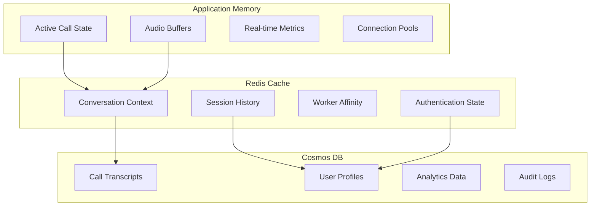
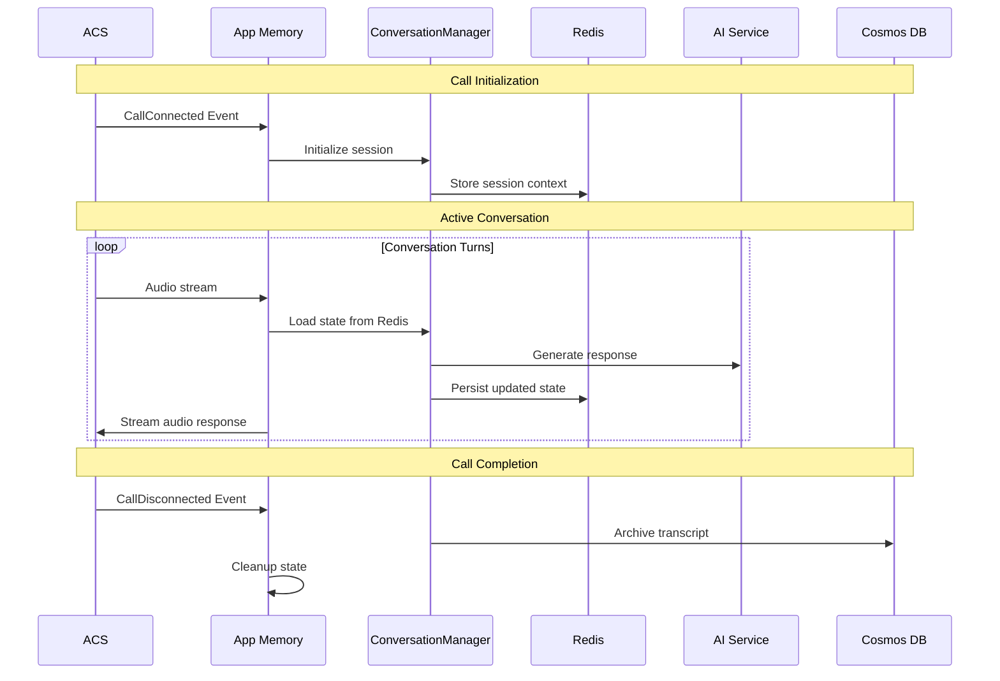

# Data Architecture & Flow Patterns

!!! abstract "Overview"
    This document describes the data architecture optimized for **real-time voice processing** with hierarchical key organization, caching strategies, and data persistence patterns for Azure Communication Services calls.

---

## Architecture Overview

The system employs a **three-tier data storage hierarchy** optimized for different access patterns and latency requirements.

### Storage Hierarchy

| Tier | Access Time | Use Cases | Capacity |
|------|-------------|-----------|----------|
| **Application Memory** | Microseconds | Active call state, audio buffers, real-time metrics | Limited by container RAM |
| **Redis Cache** | Sub-millisecond | Conversation context, session history, worker affinity | Configurable (1-100GB) |
| **Cosmos DB** | 1-10ms | Persistent conversations, analytics, audit logs | Virtually unlimited |

!!! info "Azure Documentation"
    - [Azure Cache for Redis Overview](https://learn.microsoft.com/en-us/azure/azure-cache-for-redis/cache-overview)
    - [Azure Cosmos DB for NoSQL](https://learn.microsoft.com/en-us/azure/cosmos-db/nosql/)
    - [Redis Session Store Patterns](https://learn.microsoft.com/en-us/azure/azure-cache-for-redis/cache-overview#key-scenarios)



### Storage Decision Matrix

| Data Type | Memory | Redis | Cosmos | Reasoning |
|-----------|:------:|:-----:|:------:|-----------|
| WebSocket Connections | :material-check: | | | Process-specific, ultra-low latency |
| Audio Buffers | :material-check: | | | High-frequency, temporary |
| Conversation Context | | :material-check: | | Session persistence, shared workers |
| TTS Cache | | :material-check: | | Shared across calls, time-limited |
| Call Transcripts | | | :material-check: | Permanent record, analytics |
| User Profiles | | :material-cached: | :material-check: | Long-term storage with cache layer |

---

## Redis Key Architecture

### Hierarchical Key Structure

The project uses a consistent key naming convention:

```
{app_prefix}:{environment}:{data_type}:{identifier}:{component}
```

**Examples:**

- `rtvoice:prod:call:abc123:session`
- `rtvoice:prod:conversation:xyz789:context`
- `rtvoice:dev:worker:worker-001:affinity`

### TTL Management

```python
TTL_POLICIES = {
    "conversation_context": 30 * 60,      # 30 minutes
    "session_history": 2 * 60 * 60,       # 2 hours
    "authentication_state": 15 * 60,      # 15 minutes
    "tts_cache": 24 * 60 * 60,            # 24 hours
    "call_summary": 7 * 24 * 60 * 60,     # 7 days
}
```

---

## Implementation Patterns

### Core Components

| Component | Purpose |
|-----------|---------|
| `RedisKeyManager` | Hierarchical key structure and TTL management |
| `AsyncAzureRedisManager` | Async operations for conversation and call management |
| `ConversationManager` | Conversation state with automatic migration support |

### Usage Example

```python
from src.redis import AsyncAzureRedisManager, ConversationManager

# Initialize session for ACS call
async def handle_call_connected(call_connection_id: str):
    session_key = redis_manager.key_manager.call_key(
        call_connection_id, Component.SESSION
    )
    await redis_manager.store_call_session(call_connection_id, session_data)

# Manage conversation state
async def setup_conversation(session_id: str):
    cm = await ConversationManager.from_redis(session_id, redis_mgr)
    await cm.update_context({"user_authenticated": True})
    await cm.append_to_history("user", "Hello")
```

---

## Call Lifecycle Flow



---

## Production Considerations

!!! warning "Demo vs Production"
    The current implementation provides a **simplified infrastructure** suitable for development and demonstration. Production deployments require additional hardening.

### Current State (Demo)

- Single-region Redis deployment
- Basic TTL policies
- Standard tier services
- Public endpoints with authentication

### Production Recommendations

#### Managed Messaging for Backpressure

For production workloads, consider managed messaging services to handle backpressure:

| Service | Use Case | Documentation |
|---------|----------|---------------|
| **Azure Service Bus** | Reliable message queuing with dead-letter support | [Service Bus Overview](https://learn.microsoft.com/en-us/azure/service-bus-messaging/service-bus-messaging-overview) |
| **Azure SignalR Service** | Real-time WebSocket management at scale | [SignalR Service](https://learn.microsoft.com/en-us/azure/azure-signalr/signalr-overview) |
| **Azure Event Hubs** | High-throughput event streaming | [Event Hubs](https://learn.microsoft.com/en-us/azure/event-hubs/event-hubs-about) |

These services abstract away complexities around connection management, scaling, and message delivery guarantees.

#### Network Security

- [Private endpoints for Redis](https://learn.microsoft.com/en-us/azure/azure-cache-for-redis/cache-private-link)
- [Private endpoints for Cosmos DB](https://learn.microsoft.com/en-us/azure/cosmos-db/how-to-configure-private-endpoints)
- [VNet integration for Container Apps](https://learn.microsoft.com/en-us/azure/container-apps/vnet-custom)

#### Monitoring Baselines

| Metric | Target | Alert Threshold |
|--------|--------|-----------------|
| Redis latency (p99) | < 5ms | > 10ms |
| Memory-to-Redis persistence | < 10ms | > 50ms |
| Redis memory usage | < 70% | > 80% |
| Connection pool utilization | < 80% | > 90% |

---

## Best Practices

1. **Use `call_connection_id` as session identifier** for ACS calls
2. **Batch Redis operations** using pipelines for performance
3. **Implement graceful degradation** with fallback mechanisms
4. **Monitor TTL expiration** for critical session data
5. **Use async operations** throughout for non-blocking performance

!!! tip "Key Design Principle"
    Always design for the scenario where Redis is temporarily unavailable. Critical call state should be recoverable from the application layer.

---
