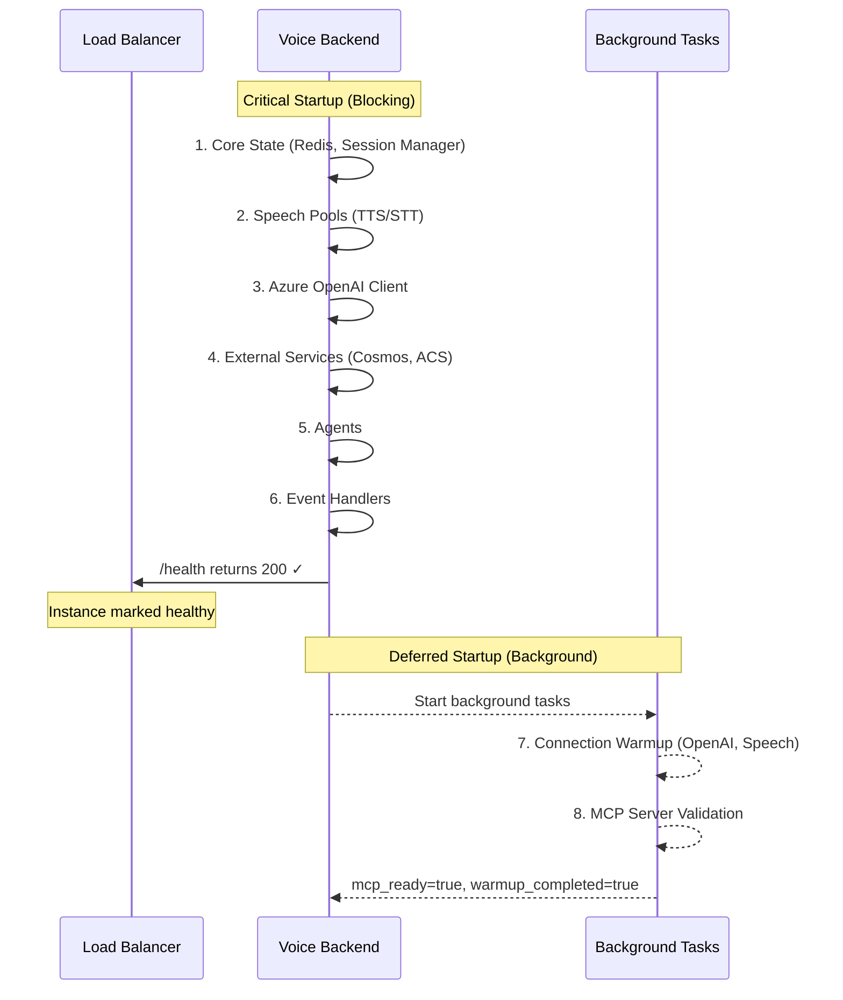
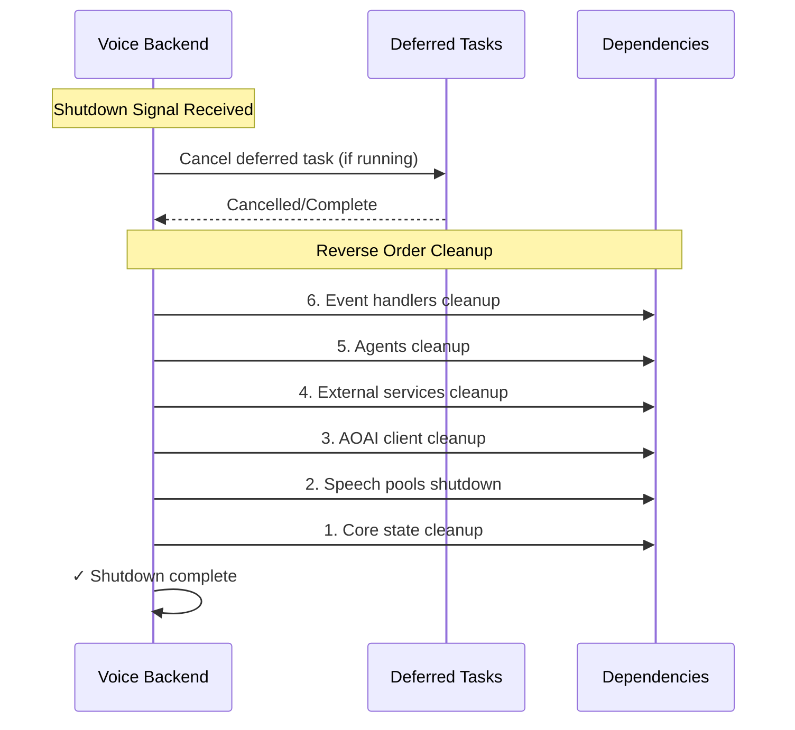

# Application Lifecycle

The backend uses a **LifecycleManager** to orchestrate startup and shutdown in a clean, observable manner. This design supports **deferred startup tasks** that run in the background after the application is ready to accept requests.

---

## Startup Architecture

### Why Deferred Startup?

Real-time voice applications prioritize fast startup. Load balancers and Kubernetes probes need the `/health` endpoint to respond quickly. Network-dependent tasks like MCP server validation would delay startup if run synchronously.

The solution: **critical steps run first, optional warmup runs in the background**.



### Startup Steps

| Step | Name | Blocking | Purpose |
|:----:|:-----|:--------:|:--------|
| 1 | `core` | Yes | Redis, Connection Manager, Session Manager |
| 2 | `speech` | Yes | TTS/STT pools with warm pooling |
| 3 | `aoai` | Yes | Azure OpenAI client initialization |
| 4 | `services` | Yes | Cosmos DB, ACS Caller, Phrase Manager |
| 5 | `agents` | Yes | Load agents from YAML, build handoff map |
| 6 | `events` | Yes | Tool registry, ACS event handlers |
| 7 | `warmup` | **No** | Pre-warm OpenAI connections, speech tokens |
| 8 | `mcp` | **No** | Validate MCP servers, register tools |

### Code Location

- **LifecycleManager**: `apps/artagent/backend/lifecycle/manager.py`
- **Startup Steps**: `apps/artagent/backend/lifecycle/steps.py`
- **FastAPI Integration**: `apps/artagent/backend/main.py`

---

## Health Endpoints

Three endpoints provide different levels of health visibility:

### `/api/v1/health` — Liveness Probe

Returns **200** as soon as the server is running. Use for load balancer liveness checks.

```json
{
  "status": "healthy",
  "timestamp": 1706803200.0,
  "message": "Real-Time Audio Agent API v1 is running",
  "active_sessions": 5,
  "session_metrics": {
    "connected": 5,
    "disconnected": 12,
    "active": 5
  }
}
```

### `/api/v1/ready` — Readiness Probe

Returns **ready: true** only when all deferred tasks have completed:

```json
{
  "ready": true,
  "timestamp": 1706803200.0,
  "deferred_startup_complete": true,
  "warmup_completed": true,
  "mcp_ready": true,
  "details": {
    "warmup_results": {"openai": true, "tts_pool": 3, "stt_pool": 2},
    "mcp_servers": {"cardapi": {"status": "healthy", "tools_count": 4}}
  }
}
```

### `/api/v1/readiness` — Comprehensive Check

Validates all critical dependencies with individual health checks:

- Redis connectivity
- Azure OpenAI client
- Speech services (pools + configuration)
- ACS Caller
- RT Agents
- Auth configuration
- MCP servers (if configured)

Returns **200** if ready, **503** if unhealthy.

---

## Kubernetes Probe Configuration

```yaml
# Recommended configuration
livenessProbe:
  httpGet:
    path: /api/v1/health
    port: 8000
  initialDelaySeconds: 5
  periodSeconds: 10

readinessProbe:
  httpGet:
    path: /api/v1/ready  # Or /api/v1/health if you accept early traffic
    port: 8000
  initialDelaySeconds: 10
  periodSeconds: 5
```

!!! tip "Choosing the Readiness Probe"
    - Use `/api/v1/health` for readiness if you accept slightly higher latency on early requests
    - Use `/api/v1/ready` for readiness if optimal performance is required from the first request

---

## Deferred MCP Startup

MCP server validation and tool registration runs as a deferred task:

### Configuration

```bash
# Enable MCP servers
MCP_ENABLED_SERVERS=cardapi,knowledge

# Mark critical servers (failures logged as errors)
MCP_REQUIRED_SERVERS=cardapi
```

### Behavior

1. **Health check**: `GET /health` returns 200 immediately
2. **Background task**: Validates MCP servers, discovers tools, registers in tool registry
3. **Ready check**: `GET /ready` returns `mcp_ready: true` after completion

### Required vs Optional Servers

| Type | On Failure | Use Case |
|:-----|:-----------|:---------|
| **Required** | Error logged, app continues | Critical tools the agent needs |
| **Optional** | Warning logged, app continues | Nice-to-have enhancements |

Required server failures don't block startup—they're logged as errors so you can investigate, but the application remains functional for scenarios that don't use those tools.

---

## Shutdown Behavior

Shutdown runs in reverse order of executed startup steps, with proper cancellation of background tasks:



### Graceful Handling

- Deferred tasks are cancelled with a 5-second timeout
- Speech pools are shutdown in parallel
- Errors during shutdown are logged but don't prevent other cleanup

---

## Observability

### OpenTelemetry Spans

Each startup step creates a trace span:
- `startup.{step_name}` — Duration and success/failure
- `startup.deferred.{step_name}` — Deferred task spans
- `shutdown.{step_name}` — Shutdown operations

### Dashboard Display

The startup dashboard shows:
- Step names and durations
- Progress indicator during startup
- Total startup time
- Deferred task queue and results

---

## Adding Custom Startup Steps

To add a new startup step:

```python
# In lifecycle/steps.py

def register_my_step(manager: LifecycleManager, app: FastAPI) -> None:
    """Register custom startup step."""
    
    async def start() -> None:
        # Initialize your component
        app.state.my_component = await create_component()
    
    async def stop() -> None:
        # Cleanup (optional)
        if hasattr(app.state, "my_component"):
            await app.state.my_component.close()
    
    # deferred=True runs in background after /health returns 200
    manager.add_step("my_component", start, stop, deferred=False)
```

Register in `lifecycle/bootstrap.py`:

```python
def register_all_steps(manager: LifecycleManager, app: FastAPI) -> None:
    # ...existing steps...
    register_my_step(manager, app)
```

---

## Related Documentation

- [MCP Integration](registries/mcp-integration.md) — MCP server configuration and deferred startup
- [API Reference](../api/README.md) — Health endpoint specifications
- [Deployment Guide](../deployment/README.md) — Production configuration
