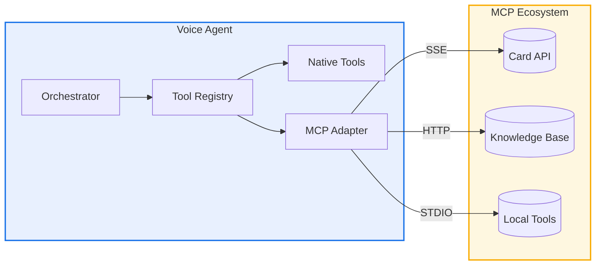
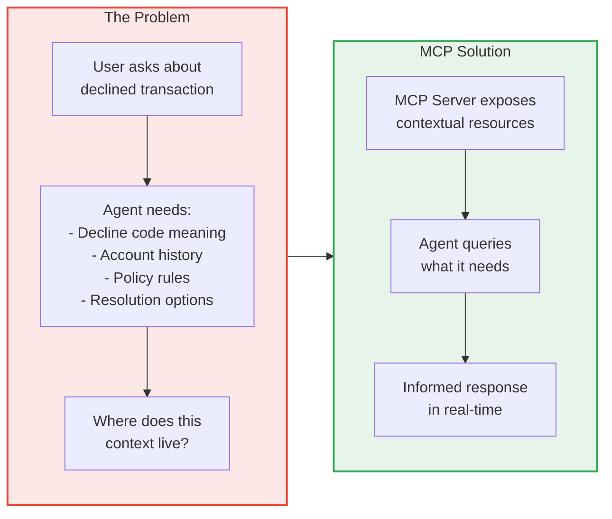
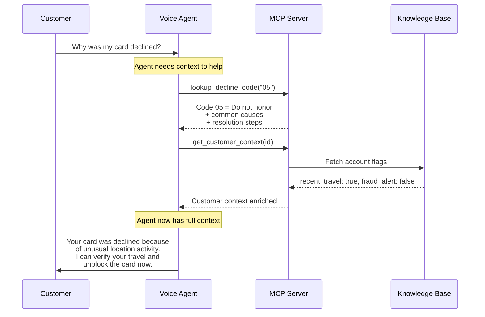
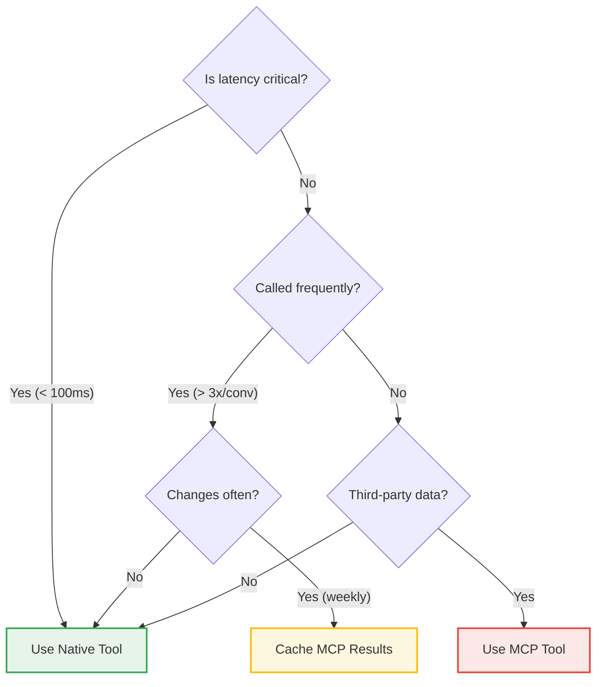
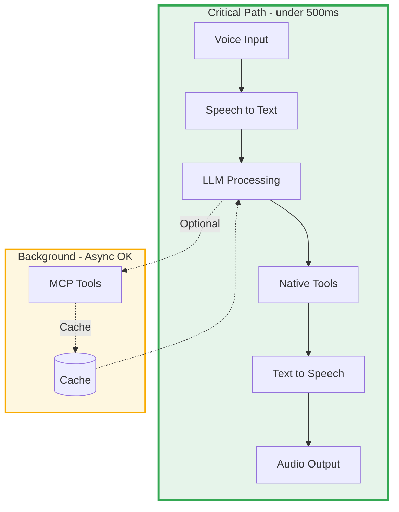
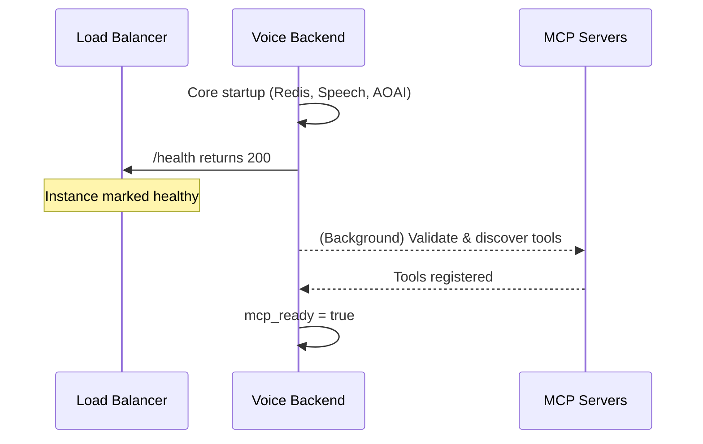
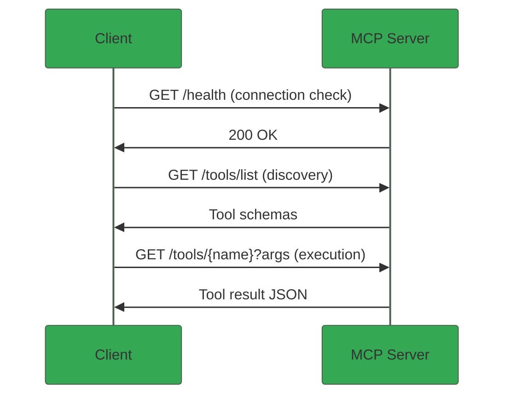
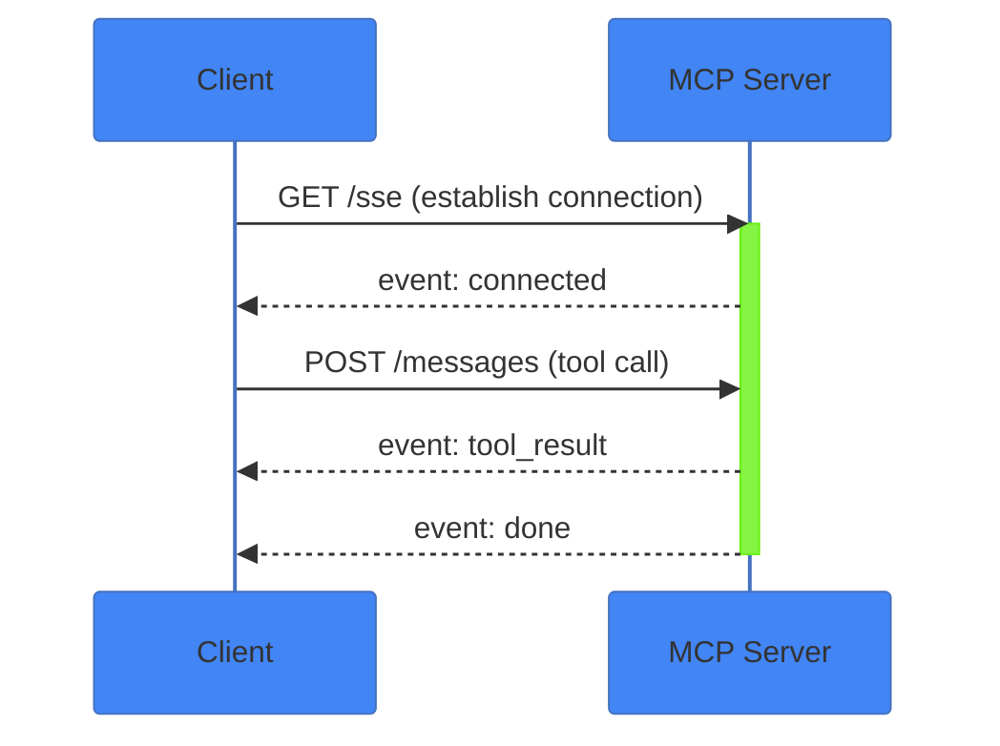
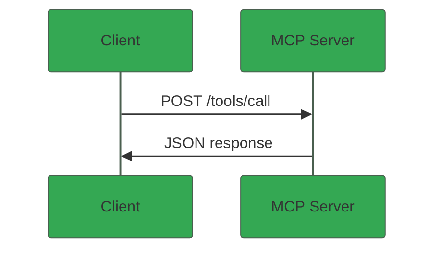

# MCP Integration Guide

<div class="grid cards" markdown>

-   :material-protocol:{ .lg .middle } **What is MCP?**

    ---

    Model Context Protocol (MCP) is an open standard for connecting AI applications to external tools, resources, and context sources dynamically.

-   :material-brain:{ .lg .middle } **Context is Key**

    ---

    Agents are only as effective as the context they have. MCP provides a standardized way to deliver the right information at the right time.

-   :material-microphone:{ .lg .middle } **Why for Voice?**

    ---

    Voice agents need instant access to context to respond naturally. MCP enables real-time context retrieval without code changes.

-   :material-puzzle:{ .lg .middle } **Dynamic Extension**

    ---
    
    Add new tools and data sources at runtime. Agents gain capabilities without restarts or redeployments.

</div>

---

## Overview

MCP provides a standardized way to expose tools, resources, and prompts from external servers. In real-time voice orchestration, MCP allows you to dynamically extend agent capabilities while the system is running.



### Key Components

<div class="grid" markdown>

:material-connection:{ .lg } **MCP Client**
:   Manages connections to MCP servers
:   Location: `toolstore/mcp/client.py`

:material-swap-horizontal:{ .lg } **MCP Adapter**
:   Bridges MCP tools to the unified registry
:   Location: `toolstore/mcp/adapter.py`

:material-cog-sync:{ .lg } **Session Manager**
:   Handles MCP server lifecycle and health
:   Location: `toolstore/mcp/session_manager.py`

:material-api:{ .lg } **Runtime API**
:   REST endpoints for dynamic server management
:   Location: `api/v1/endpoints/mcp.py`

</div>

---

## Context Management for Agents

!!! abstract "Why Context Matters"
    In agentic systems, **context is everything**. An agent is only as effective as the information it has access to. MCP provides a standardized way to deliver the right context to agents at the right time—enabling them to make informed decisions and execute tasks successfully.

### The Context Challenge

Voice agents face unique context challenges:



### MCP Context Primitives

MCP provides three mechanisms for delivering context to agents:

| Primitive | Purpose | When to Use |
|-----------|---------|-------------|
| **Tools** | Execute actions, retrieve dynamic data | Real-time lookups, transactions, API calls |
| **Resources** | Expose static or semi-static content | Documentation, policies, reference data |
| **Prompts** | Provide templated instructions | Specialized workflows, domain expertise |

### Context Flow in Agentic Workflows

Consider a customer calling about a declined credit card:



### Designing Context-Aware MCP Servers

!!! tip "Design Principle"
    Build MCP servers that anticipate what agents need. Return comprehensive context in single calls rather than requiring multiple round-trips.

**Pattern: Rich Context Responses**

Instead of minimal responses:

```json
{
  "code": "05",
  "description": "Do not honor"
}
```

Return actionable context:

```json
{
  "code": "05",
  "description": "Do not honor",
  "category": "issuer_decline",
  "common_causes": [
    "Unusual transaction location",
    "Velocity limit exceeded",
    "Account restrictions"
  ],
  "resolution_options": [
    {"action": "verify_identity", "description": "Verify customer and retry"},
    {"action": "contact_issuer", "description": "Escalate to issuing bank"},
    {"action": "alternative_payment", "description": "Suggest different payment method"}
  ],
  "agent_script": "I see your card was declined with a 'Do not honor' response...",
  "requires_escalation": false
}
```

### Context Strategies by Use Case

=== ":material-bank: Banking"

    **Key Context Needs:**
    
    - Account balances and transaction history
    - Fraud detection signals
    - Customer preferences and history
    - Regulatory compliance rules
    
    **MCP Server Design:**
    
    ```yaml
    # banking-context-mcp
    tools:
      - get_account_context    # Full account snapshot
      - get_transaction_context  # Transaction + merchant + category
      - get_compliance_context   # Applicable rules for action
    resources:
      - banking_policies      # Current bank policies
      - product_catalog       # Available products for offers
    ```

=== ":material-shield-check: Insurance"

    **Key Context Needs:**
    
    - Policy details and coverage
    - Claims history
    - Provider networks
    - Regulatory requirements by state
    
    **MCP Server Design:**
    
    ```yaml
    # insurance-context-mcp
    tools:
      - get_policy_context     # Policy + coverage + exclusions
      - get_claims_context     # Claim status + history + documents
      - get_provider_context   # In-network providers + ratings
    resources:
      - coverage_explanations  # Plain-language coverage docs
      - state_regulations      # State-specific rules
    ```

=== ":material-headset: General Support"

    **Key Context Needs:**
    
    - Product documentation
    - Troubleshooting guides
    - Customer interaction history
    - Escalation procedures
    
    **MCP Server Design:**
    
    ```yaml
    # support-context-mcp
    tools:
      - search_knowledge_base  # RAG over support docs
      - get_customer_history   # Past interactions + resolutions
      - get_escalation_path    # Who to escalate to and when
    resources:
      - product_manuals        # Detailed product docs
      - troubleshooting_trees  # Decision trees for issues
    ```

### Context Window Management

!!! warning "LLM Context Limits"
    LLMs have finite context windows. MCP servers should return focused, relevant context rather than dumping everything available.

**Strategies for Efficient Context:**

1. **Summarize when possible** - Return summaries for historical data
2. **Prioritize recency** - Recent transactions matter more than old ones
3. **Filter by relevance** - Only return context related to the current query
4. **Use pagination** - Allow agents to request more if needed

```python
# Example: Context-aware tool response
async def get_transaction_context(args: dict) -> dict:
    account_id = args["account_id"]
    query_intent = args.get("intent", "general")  # What is agent trying to do?
    
    # Fetch base data
    transactions = await db.get_recent_transactions(account_id, limit=10)
    
    # Enrich based on intent
    if query_intent == "dispute":
        # Include merchant details, dispute eligibility
        transactions = enrich_for_dispute(transactions)
    elif query_intent == "budget":
        # Include category summaries
        transactions = enrich_with_categories(transactions)
    
    return {
        "transactions": transactions,
        "summary": generate_summary(transactions),
        "suggested_actions": get_actions_for_intent(query_intent)
    }
```

---

## Tool Execution: Native vs MCP

The framework supports two complementary approaches for tool execution. Understanding when to use each is essential for building responsive voice applications.

### Side-by-Side Comparison

=== ":material-lightning-bolt: Native Tools"

    Native tools are Python functions registered directly with the tool registry. They execute in-process with minimal overhead.

    ```python
    async def get_account_balance(args: dict) -> dict:
        """Native tool - executes in-process."""
        client_id = args.get("client_id")
        balance = await db.get_balance(client_id)
        return {"success": True, "balance": balance}

    register_tool("get_account_balance", schema, get_account_balance)
    ```

    **Advantages**
    
    | Aspect | Benefit |
    |--------|---------|
    | :material-timer: Latency | ~1-5ms overhead |
    | :material-cog: Control | Full implementation control |
    | :material-shield-check: Type Safety | Python static analysis |

    **Trade-offs**
    
    | Aspect | Limitation |
    |--------|------------|
    | :material-upload: Deployment | Requires code deployment for changes |
    | :material-link: Coupling | Tightly coupled to application |

=== ":material-cloud-outline: MCP Tools"

    MCP tools execute on remote servers via HTTP or SSE transport. They're discovered automatically at runtime.

    ```json
    {
      "name": "lookup_decline_code",
      "description": "Look up card decline code policy",
      "input_schema": {
        "type": "object",
        "properties": {
          "code": {"type": "string"}
        }
      }
    }
    ```

    **Advantages**
    
    | Aspect | Benefit |
    |--------|---------|
    | :material-magnify: Discovery | Tools appear without code changes |
    | :material-language-python: Polyglot | Servers can be any language |
    | :material-rocket-launch: Independence | Deploy tools separately |

    **Trade-offs**
    
    | Aspect | Limitation |
    |--------|------------|
    | :material-clock-outline: Latency | ~50-200ms network overhead |
    | :material-alert-circle: Reliability | Network/server failure modes |

---

## Latency Considerations for Voice

!!! warning "Real-Time Constraint"
    Voice interactions target **< 1 second** end-to-end latency. Tool execution should stay under **200ms** when possible. MCP adds network overhead that can impact perceived responsiveness.

### Latency Comparison

| Scenario | Native Tool | MCP (HTTP) | MCP (SSE) | Voice Budget |
|:---------|:-----------:|:----------:|:---------:|:------------:|
| Simple lookup | 2-5ms | 50-150ms | 30-100ms | :material-check-circle:{ .green } |
| Database query | 10-50ms | 60-200ms | 40-150ms | :material-check-circle:{ .green } |
| External API | 100-500ms | 150-600ms | 120-550ms | :material-alert:{ .yellow } |
| Multiple chained | 50-100ms | 300-800ms | 200-600ms | :material-close-circle:{ .red } |

### Decision Matrix

Use this guide to choose the right approach:



### Recommended Architecture

Combine both approaches for optimal performance:



---

## Startup Behavior: Deferred MCP Initialization

!!! info "Non-Blocking MCP Startup"
    MCP server validation and tool registration runs as a **deferred startup task**. This means the application starts accepting HTTP requests immediately while MCP connections are established in the background.

### Why Deferred?

Real-time voice applications prioritize fast startup. MCP server validation involves network calls that could delay the `/health` endpoint from responding, which would cause load balancers to mark the instance as unhealthy.



### Readiness Endpoints

| Endpoint | Purpose | When to Use |
|:---------|:--------|:------------|
| `/api/v1/health` | Liveness check | Load balancer probes |
| `/api/v1/ready` | Full readiness including MCP | Traffic routing decisions |
| `/api/v1/readiness` | Comprehensive dependency check | Debugging, detailed status |

The `/ready` endpoint returns `ready: true` only when:
- `deferred_startup_complete` - All deferred tasks finished
- `warmup_completed` - OpenAI/Speech warmup done
- `mcp_ready` - MCP servers validated and tools registered

### Required vs Optional MCP Servers

Configure `MCP_REQUIRED_SERVERS` to list servers that **must** be healthy:

```bash
MCP_ENABLED_SERVERS=cardapi,knowledge,analytics
MCP_REQUIRED_SERVERS=cardapi  # Only cardapi is critical
```

- **Required servers** - Failures are logged as errors (but don't block startup)
- **Optional servers** - Failures are logged as warnings

---

## Configuration

### Environment Variables

Configure MCP servers using environment variables for automatic loading at startup.

```bash title=".env"
# Enable/disable MCP server auto-loading
MCP_ENABLED_SERVERS=cardapi,knowledge

# Server-specific configuration
MCP_SERVER_CARDAPI_URL=http://cardapi-mcp:8080
MCP_SERVER_CARDAPI_TRANSPORT=sse
MCP_SERVER_CARDAPI_TIMEOUT=30

MCP_SERVER_KNOWLEDGE_URL=http://kb-mcp:8080
MCP_SERVER_KNOWLEDGE_TRANSPORT=http
```

!!! note "Legacy CardAPI variables removed"
    Use **only** `MCP_SERVER_*` variables for CardAPI tooling.

    - ✅ Set: `MCP_SERVER_CARDAPI_URL` (and optional `MCP_SERVER_CARDAPI_TRANSPORT`)
    - ❌ Do not use: `CARDAPI_URL`, `CARDAPI_MCP_URL` (ignored by the backend)

### Settings Reference

| Variable | Default | Description |
|:---------|:-------:|:------------|
| `MCP_ENABLED_SERVERS` | `""` | Comma-separated list of servers to auto-load |
| `MCP_REQUIRED_SERVERS` | `""` | Comma-separated list of servers that must be healthy (errors logged but non-blocking) |
| `MCP_SERVER_{NAME}_URL` | — | Base URL for the MCP server |
| `MCP_SERVER_{NAME}_TRANSPORT` | `streamable-http` | Transport type: `streamable-http`, `sse`, `http`, or `stdio` |
| `MCP_SERVER_{NAME}_TIMEOUT` | `30` | Connection timeout in seconds |
| `MCP_SERVER_{NAME}_AUTH_ENABLED` | `false` | Whether EasyAuth authentication is enabled |
| `MCP_SERVER_{NAME}_APP_ID` | `""` | Azure AD App ID for EasyAuth token acquisition |
| `MCP_SERVER_TIMEOUT` | `30` | Global default timeout |

### Agent YAML Configuration

Assign MCP tools to agents using the prefixed tool name format:

```yaml title="registries/agentstore/decline_specialist/agent.yaml"
name: DeclineSpecialist
description: Specialist for card decline inquiries

model:
  deployment_id: gpt-4o
  temperature: 0.7

tools:
  # Native tools (fast, in-process)
  - verify_client_identity
  - get_recent_transactions
  
  # MCP tools (prefixed with server name)
  - cardapi_lookup_decline_code    # (1)!
  - cardapi_search_decline_codes

voice:
  current_voice: en-US-AndrewNeural
```

1.  MCP tools use the format `{server_name}_{tool_name}`. The `cardapi` prefix indicates this tool comes from the `cardapi` MCP server.

---

## Runtime MCP Management

!!! info "No Restart Required"
    The runtime API allows you to add, test, and remove MCP servers while the application is running. Newly registered tools become immediately available to agents.

### API Endpoints Overview

| Endpoint | Method | Purpose |
|:---------|:------:|:--------|
| `/api/v1/mcp/servers` | GET | List all servers with status |
| `/api/v1/mcp/servers` | POST | Add and register a new server |
| `/api/v1/mcp/servers/test` | POST | Test connection without registering |
| `/api/v1/mcp/servers/{name}` | DELETE | Remove server and unregister tools |
| `/api/v1/mcp/tools` | GET | List all registered MCP tools |

For complete API documentation, see the [MCP API Reference](../../api/mcp-api.md).

### Quick Start Example

=== ":material-bash: cURL"

    ```bash
    # Step 1: Test the connection
    curl -X POST http://localhost:8000/api/v1/mcp/servers/test \
      -H "Content-Type: application/json" \
      -d '{"name": "cardapi", "url": "http://cardapi-mcp:8080"}' | jq

    # Step 2: Register the server
    curl -X POST http://localhost:8000/api/v1/mcp/servers \
      -H "Content-Type: application/json" \
      -d '{"name": "cardapi", "url": "http://cardapi-mcp:8080"}' | jq
    ```

=== ":material-language-python: Python"

    ```python
    import httpx

    async def setup_mcp_server():
        async with httpx.AsyncClient() as client:
            # Step 1: Test the connection
            response = await client.post(
                "http://localhost:8000/api/v1/mcp/servers/test",
                json={"name": "cardapi", "url": "http://cardapi-mcp:8080"}
            )
            test = response.json()
            print(f"Found {test['tools_count']} tools")
            
            # Step 2: Register if healthy
            if test["connected"]:
                response = await client.post(
                    "http://localhost:8000/api/v1/mcp/servers",
                    json={"name": "cardapi", "url": "http://cardapi-mcp:8080"}
                )
                print(response.json()["message"])
    ```

### Frontend Integration

The Agent Builder UI includes a built-in MCP management panel:

```
+--------------------------------------------------+
| MCP Servers                                       |
+--------------------------------------------------+
| [*] cardapi              4 tools        [Remove] |
|     http://cardapi-mcp:8080                      |
|                                                  |
| [ ] knowledge (error)    0 tools        [Remove] |
|     Connection refused                           |
|                                                  |
| [+ Add MCP Server]                               |
+--------------------------------------------------+
```

---

## Authentication Patterns

MCP servers often require authentication. The framework supports multiple methods.

### :material-key: Bearer Token

For servers accepting static API keys or service tokens.

```python
response = await httpx.post(
    "/api/v1/mcp/servers",
    json={
        "name": "secure-mcp",
        "url": "https://api.example.com/mcp",
        "auth_token": "sk-abc123..."  # (1)!
    }
)
```

1.  The token is automatically added as `Authorization: Bearer sk-abc123...` header on all requests.

### :material-tune: Custom Headers

For non-standard authentication schemes.

```python
response = await httpx.post(
    "/api/v1/mcp/servers",
    json={
        "name": "custom-auth-mcp",
        "url": "https://api.example.com/mcp",
        "headers": {
            "X-API-Key": "abc123",
            "X-Tenant-ID": "tenant-456"
        }
    }
)
```

### :material-account-key: OAuth 2.0 with PKCE

For servers requiring user-delegated authorization (On-Behalf-Of flows).

??? example "Complete OAuth Flow"

    **Step 1: Initiate the flow**
    
    ```python
    start_response = await httpx.post(
        "/api/v1/mcp/oauth/start",
        json={
            "name": "enterprise-mcp",
            "url": "https://mcp.enterprise.com",
            "oauth": {
                "client_id": "app-client-id",
                "auth_url": "https://login.microsoftonline.com/{tenant}/oauth2/v2.0/authorize",
                "token_url": "https://login.microsoftonline.com/{tenant}/oauth2/v2.0/token",
                "scope": "api://mcp-server/.default"
            },
            "redirect_uri": "https://yourapp.com/oauth/callback"
        }
    )
    auth_url = start_response.json()["auth_url"]
    # Redirect user to auth_url in popup or new tab
    ```
    
    **Step 2: Exchange the code**
    
    ```python
    # After user authorizes and callback receives code
    callback_response = await httpx.post(
        "/api/v1/mcp/oauth/callback",
        json={
            "code": "authorization_code_from_callback",
            "state": "state_from_start_response"
        }
    )
    # Token is stored and used automatically for future MCP requests
    ```

!!! tip "PKCE Security"
    The OAuth flow automatically generates and validates PKCE code verifiers using the S256 challenge method. No additional configuration required.

---

## Transport Protocols

MCP supports multiple transport mechanisms, each suited to different use cases.

### Comparison

| Transport | Best For | Connection | Latency |
|:----------|:---------|:-----------|:--------|
| :material-broadcast: **STREAMABLE_HTTP** | Production deployments (recommended) | Per-request with streaming | Medium |
| :material-broadcast: **SSE** | Streaming, long-lived connections (legacy) | Persistent | Lower |
| :material-swap-horizontal: **HTTP** | Simple requests, alias for streamable-http | Per-request | Medium |
| :material-console: **STDIO** | Local CLI tools, development | Process | Lowest |

!!! info "Per MCP Spec 2025-11-25"
    The `streamable-http` transport is now the recommended protocol for deployed MCP servers. SSE is still supported but considered legacy. The `http` type is an alias for `streamable-http`.

### Streamable HTTP (Recommended)

Best for production deployments. Per MCP spec 2025-11-25, this is now the recommended transport.



### SSE (Server-Sent Events) - Legacy

Still supported for streaming responses and long-lived connections.



### HTTP Alias

The `http` transport type is an alias for `streamable-http` for backward compatibility.



### STDIO (Local Process)

!!! warning "Development Only"
    STDIO transport spawns a local process and communicates via stdin/stdout. Use only for local development; production deployments should use HTTP or SSE.

---

## Best Practices

### :material-numeric-1-circle: Minimize MCP in Critical Path

```python
# Avoid: Chaining multiple MCP calls
async def handle_inquiry(args):
    code = await mcp.call("lookup_code", args)      # +100ms
    policy = await mcp.call("get_policy", code)     # +100ms
    script = await mcp.call("get_script", policy)   # +100ms
    return script  # Total: 300ms+ overhead

# Better: Single comprehensive call
async def handle_inquiry(args):
    # MCP server returns complete data in one call
    result = await mcp.call("lookup_code_complete", args)  # +100ms
    return result
```

### :material-numeric-2-circle: Cache Reference Data

```python
from functools import lru_cache
from datetime import datetime, timedelta

class CachedMCPClient:
    def __init__(self, session):
        self.session = session
        self._cache = {}
        self._ttl = timedelta(minutes=5)
    
    async def lookup_decline_code(self, code: str) -> dict:
        cache_key = f"decline:{code}"
        cached = self._cache.get(cache_key)
        
        if cached and datetime.now() < cached["expires"]:
            return cached["data"]
        
        result = await self.session.call_tool(
            "lookup_decline_code", 
            {"code": code}
        )
        
        self._cache[cache_key] = {
            "data": result,
            "expires": datetime.now() + self._ttl
        }
        return result
```

### :material-numeric-3-circle: Set Aggressive Timeouts

```yaml title=".env"
# Voice path: fail fast
MCP_SERVER_TIMEOUT=5

# Background jobs: more lenient
MCP_SERVER_BATCH_TIMEOUT=30
```

### :material-numeric-4-circle: Implement Graceful Degradation

```python
async def get_decline_info(code: str) -> dict:
    try:
        return await mcp.call_tool("lookup_decline_code", {"code": code})
    except TimeoutError:
        logger.warning(f"MCP timeout for code {code}, using fallback")
        return {
            "success": True,
            "message": f"Decline code {code} - please hold while I look up details.",
            "partial": True
        }
```

### :material-numeric-5-circle: Monitor Performance

```python
from opentelemetry import trace

tracer = trace.get_tracer(__name__)

async def call_mcp_traced(tool_name: str, args: dict) -> dict:
    with tracer.start_as_current_span(
        f"mcp.{tool_name}",
        attributes={
            "mcp.server": session.config.name,
            "mcp.tool": tool_name,
        }
    ) as span:
        start = time.perf_counter()
        try:
            result = await session.call_tool(tool_name, args)
            span.set_attribute("mcp.success", True)
            return result
        except Exception as e:
            span.set_attribute("mcp.success", False)
            span.record_exception(e)
            raise
        finally:
            latency_ms = (time.perf_counter() - start) * 1000
            span.set_attribute("mcp.latency_ms", latency_ms)
```

---

## Troubleshooting

??? question "MCP server not discovered at startup"
    
    **Checklist:**
    
    1. Verify `MCP_ENABLED_SERVERS` includes your server name
    2. Check `MCP_SERVER_{NAME}_URL` is set correctly (case-sensitive)
    3. Ensure the MCP server is running and reachable
    4. Check application logs for connection errors:
    
    ```bash
    grep -i "mcp" logs/application.log
    ```

??? question "Tools show as unavailable in agent"
    
    **Checklist:**
    
    1. Verify server is healthy: `GET /api/v1/mcp/servers`
    2. Check tool names include the server prefix (e.g., `cardapi_lookup_code`)
    3. Ensure the tool is listed in the agent's `tools` array
    4. Verify no naming conflicts with native tools

??? question "High latency on MCP calls"
    
    **Optimization steps:**
    
    1. Check network path between agent and MCP server
    2. Colocate services (same region/VNet reduces ~50ms)
    3. Implement caching for read-heavy patterns
    4. Profile server-side execution time
    5. Consider switching from HTTP to SSE transport

??? question "Authentication errors (401/403)"
    
    **Debug steps:**
    
    1. Verify token hasn't expired
    2. Check audience/scope configuration matches server expectations
    3. For OAuth: Ensure `redirect_uri` exactly matches registered callback
    4. Inspect server logs for specific auth failure reason
    5. Test with cURL to isolate client vs server issues

---

## Related Documentation

<div class="grid cards" markdown>

-   :material-tools:{ .lg .middle } **Tool Development**

    ---

    Learn how to create native tools for the registry.

    [:octicons-arrow-right-24: Tools Guide](tools.md)

-   :material-robot:{ .lg .middle } **Agent Configuration**

    ---

    Configure agents to use native and MCP tools.

    [:octicons-arrow-right-24: Agents Guide](agents.md)

-   :material-api:{ .lg .middle } **API Reference**

    ---

    Complete MCP API endpoint documentation.

    [:octicons-arrow-right-24: MCP API](../../api/mcp-api.md)

-   :material-chart-line:{ .lg .middle } **Monitoring**

    ---

    Set up observability for MCP tool calls.

    [:octicons-arrow-right-24: Monitoring Guide](../../operations/monitoring.md)

</div>
