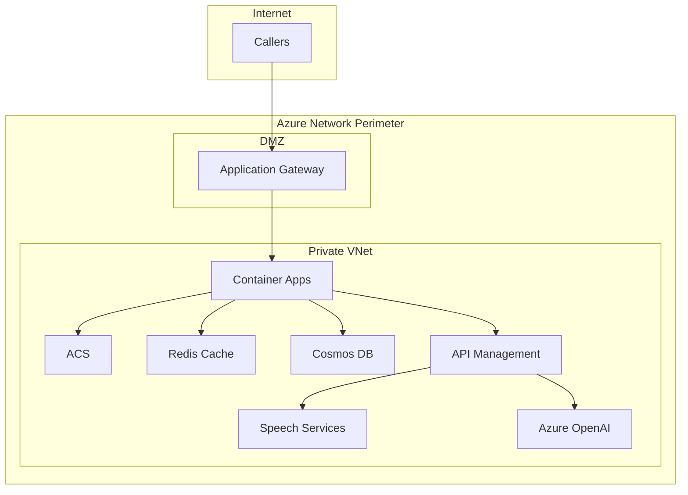
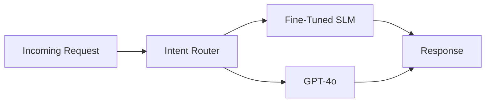

# Production Deployment Guide

!!! warning "Demo vs Production"
    This accelerator provides a **simplified infrastructure** designed for learning and demonstration purposes. Production deployments require significant additional hardening, security controls, and architectural considerations outlined in this guide.

---

## Current State

The accelerator implements a "flat" architecture optimized for rapid deployment and experimentation:

| Component | Demo Implementation | Production Requirement |
|-----------|---------------------|------------------------|
| **Networking** | Public endpoints with authentication | Private endpoints, VNet integration |
| **Authentication** | Basic scaffolding | Full identity management, MFA |
| **API Gateway** | Direct container access | API Management with rate limiting |
| **Message Queuing** | In-process handling | Managed messaging service |
| **Observability** | Application Insights | Full monitoring stack with alerting |

---

## Security Hardening

### Network Perimeter

Production deployments should isolate all services within a private network:



#### Application Gateway for SSL Termination

Use Azure Application Gateway as the ingress point for all HTTP/WebSocket traffic:

- Centralized SSL/TLS termination with managed certificates
- Web Application Firewall (WAF) for threat protection
- Path-based routing and load balancing
- Health probes for backend availability

!!! info "Documentation"
    - [Application Gateway Overview](https://learn.microsoft.com/en-us/azure/application-gateway/overview)
    - [WAF on Application Gateway](https://learn.microsoft.com/en-us/azure/web-application-firewall/ag/ag-overview)
    - [End-to-end TLS](https://learn.microsoft.com/en-us/azure/application-gateway/ssl-overview)

#### API Management as AI Gateway

Azure API Management provides critical controls for AI workloads:

| Capability | Purpose |
|------------|---------|
| **Rate Limiting** | Prevent resource exhaustion and cost overruns |
| **Token Counting** | Track and limit Azure OpenAI token consumption |
| **Request Transformation** | Normalize requests across different AI models |
| **Caching** | Cache common responses to reduce latency and cost |
| **Circuit Breaking** | Graceful degradation when backends fail |

!!! info "Documentation"
    - [API Management Overview](https://learn.microsoft.com/en-us/azure/api-management/api-management-key-concepts)
    - [AI Gateway Capabilities](https://learn.microsoft.com/en-us/azure/api-management/genai-gateway-capabilities)
    - [Token Rate Limiting](https://learn.microsoft.com/en-us/azure/api-management/azure-openai-token-limit-policy)

#### Private Endpoints

All Azure services should be accessed via private endpoints:

| Service | Documentation |
|---------|---------------|
| Azure Communication Services | [ACS Private Link](https://learn.microsoft.com/en-us/azure/communication-services/concepts/networking/private-link) |
| Azure Cache for Redis | [Redis Private Link](https://learn.microsoft.com/en-us/azure/azure-cache-for-redis/cache-private-link) |
| Cosmos DB | [Cosmos DB Private Link](https://learn.microsoft.com/en-us/azure/cosmos-db/how-to-configure-private-endpoints) |
| Azure OpenAI | [AOAI Private Link](https://learn.microsoft.com/en-us/azure/ai-services/cognitive-services-virtual-networks) |
| Speech Services | [Speech Private Endpoints](https://learn.microsoft.com/en-us/azure/ai-services/speech-service/speech-services-private-link) |
| Container Apps | [VNet Integration](https://learn.microsoft.com/en-us/azure/container-apps/vnet-custom) |

---

### Authentication Architecture

!!! note "Current State"
    The accelerator provides **scaffolding** for authentication flows (see [Authentication Guide](../security/authentication.md)), but production implementations require building out the full identity management layer.

Production authentication should include:

1. **Azure Entra ID** for operator/admin access
2. **Managed Identity** for all service-to-service communication
3. **Call Authentication** via DTMF, SIP headers, or external IDP
4. **Session Validation** with secure token management

!!! info "Documentation"
    - [Managed Identity Overview](https://learn.microsoft.com/en-us/entra/identity/managed-identities-azure-resources/overview)
    - [ACS Authentication](https://learn.microsoft.com/en-us/azure/communication-services/concepts/authentication)
    - [Key Vault for Secrets](https://learn.microsoft.com/en-us/azure/key-vault/general/overview)

---

## Scalability Patterns

### Managed Messaging for Backpressure

The demo implementation handles message flow in-process, which limits scalability and resilience. Production deployments should introduce managed messaging services:

| Service | Use Case | Benefits |
|---------|----------|----------|
| **Azure Service Bus** | Command/event queuing | Dead-letter support, transactions, ordering |
| **Azure SignalR Service** | WebSocket management | Connection offloading, auto-scaling |
| **Azure Event Hubs** | High-throughput streaming | Partitioned ingestion, replay capability |

These services address:

- **Connection Management** - Handle thousands of concurrent WebSocket connections
- **Backpressure Handling** - Queue-based buffering prevents overload
- **Failure Isolation** - Failed processing doesn't block healthy flows
- **Horizontal Scaling** - Stateless workers scale independently

!!! info "Documentation"
    - [Service Bus Overview](https://learn.microsoft.com/en-us/azure/service-bus-messaging/service-bus-messaging-overview)
    - [SignalR Service](https://learn.microsoft.com/en-us/azure/azure-signalr/signalr-overview)
    - [Event Hubs](https://learn.microsoft.com/en-us/azure/event-hubs/event-hubs-about)

### Container Apps Configuration

```yaml
scale:
  minReplicas: 2
  maxReplicas: 20
  rules:
    - name: http-requests
      http:
        metadata:
          concurrentRequests: "50"
    - name: cpu-utilization
      custom:
        type: cpu
        metadata:
          value: "70"
```

---

## Observability

### Monitoring Stack

| Tool | Purpose |
|------|---------|
| **Application Insights** | Distributed tracing, request logging |
| **Azure Monitor** | Infrastructure metrics, alerting |
| **Log Analytics** | Centralized log aggregation |
| **Dashboards** | Real-time operational visibility |

### Key Metrics

| Category | Metric | Target | Alert Threshold |
|----------|--------|--------|-----------------|
| Latency | End-to-end response | < 2.5s | > 4s |
| Latency | STT processing | < 500ms | > 1s |
| Latency | TTS generation | < 1s | > 2s |
| Availability | Service uptime | 99.9% | < 99.5% |
| Quality | Call drop rate | < 1% | > 2% |
| Resources | Container CPU | < 70% | > 85% |
| Resources | Redis memory | < 70% | > 80% |

### Correlation

Ensure all logs include correlation identifiers:

- `callConnectionId` - ACS call identifier
- `sessionId` - Application session
- `requestId` - Individual request tracking

---

## Deployment Checklist

### Pre-Production

- [ ] Private endpoints configured for all services
- [ ] Application Gateway with WAF deployed
- [ ] API Management configured with rate limiting
- [ ] Managed Identity enabled (no connection strings)
- [ ] Key Vault integration for all secrets
- [ ] Monitoring dashboards and alerts configured
- [ ] Load testing completed at target scale
- [ ] Security assessment performed
- [ ] Disaster recovery procedures documented

### Go-Live

- [ ] Production environment validated
- [ ] Rollback procedures tested
- [ ] Support team trained and on standby
- [ ] Incident response playbooks ready
- [ ] Performance baselines established

### Post-Launch

- [ ] Metrics reviewed against targets
- [ ] Cost optimization opportunities identified
- [ ] Continuous improvement roadmap updated

---

## Cost Optimization

| Strategy | Implementation |
|----------|----------------|
| **Right-sizing** | Start with minimum SKUs, scale based on usage |
| **Reserved Capacity** | 1-year reservations for predictable workloads |
| **Auto-scaling** | Scale down during off-peak hours |
| **Caching** | Cache TTS responses and common AI completions |
| **Idle Timeout** | End idle sessions after 60 seconds |

### Cascade Architecture with Fine-Tuned SLMs

For production workloads, consider implementing a **cascade architecture** that routes requests through progressively capable models:



| Tier | Model | Use Case | Cost Profile |
|------|-------|----------|--------------|
| **Tier 1** | Fine-tuned Phi-3/SLM | Common intents, FAQ responses | Low |
| **Tier 2** | GPT-4o-mini | Moderate complexity, structured outputs | Medium |
| **Tier 3** | GPT-4o | Complex reasoning, multi-turn context | High |

Benefits of cascade routing:

- **80-90% cost reduction** by handling common queries with SLMs
- **Lower latency** for simple requests (SLMs respond faster)
- **Graceful fallback** when SLM confidence is low
- **Domain specialization** through fine-tuning on your conversation data

!!! info "Documentation"
    - [Azure AI Model Catalog](https://learn.microsoft.com/en-us/azure/machine-learning/concept-model-catalog)
    - [Fine-tuning Azure OpenAI models](https://learn.microsoft.com/en-us/azure/ai-services/openai/how-to/fine-tuning)
    - [Phi-3 Models](https://azure.microsoft.com/en-us/products/phi-3)

---

## Context Management

### Structured Memory and Context Optimization

Large language models have finite context windows. Production deployments should implement structured memory patterns to optimize token usage and maintain conversation coherence:

| Pattern | Description | Benefit |
|---------|-------------|---------|
| **Hierarchical Summarization** | Summarize older turns, keep recent turns verbatim | Reduces tokens while preserving context |
| **Semantic Chunking** | Store conversation segments by topic/intent | Enables selective retrieval |
| **Memory Tiering** | Hot (Redis) → Warm (Cosmos) → Cold (Blob) | Cost-effective storage with fast access |
| **Entity Extraction** | Extract and persist key entities separately | Compact context representation |

Consider exploring:

- **Azure AI Foundry** for managed memory and agent orchestration
- **Semantic Kernel** for structured memory plugins
- **Custom embeddings** for conversation similarity search

!!! info "Documentation"
    - [Azure AI Foundry](https://azure.microsoft.com/en-us/products/ai-foundry)
    - [Semantic Kernel Memory](https://learn.microsoft.com/en-us/semantic-kernel/concepts/ai-services/chat-completion/memory)
    - [RAG Patterns](https://learn.microsoft.com/en-us/azure/architecture/ai-ml/architecture/baseline-openai-e2e-chat)

---

## Evaluations

### Quality Assurance for AI Agents

Production AI agents require systematic evaluation to ensure quality, safety, and alignment with business objectives.

!!! note "Current State"
    The accelerator includes evaluation scaffolding in [samples/labs/dev/evaluation_playground.ipynb](../../samples/labs/dev/evaluation_playground.ipynb). This provides a starting point for building comprehensive evaluation pipelines.

#### Evaluation Dimensions

| Dimension | Metrics | Tools |
|-----------|---------|-------|
| **Fluency** | Coherence, grammar, naturalness | Azure AI Evaluation SDK |
| **Groundedness** | Factual accuracy, hallucination detection | Promptflow evaluators |
| **Relevance** | Response appropriateness, intent alignment | Custom evaluators |
| **Safety** | Content filtering, PII detection | Azure AI Content Safety |
| **Latency** | End-to-end response time, P95 targets | Application Insights |

#### Recommended Approach

1. **Baseline Metrics** - Establish performance benchmarks before changes
2. **Golden Dataset** - Curate representative conversations with expected outputs
3. **Automated Pipelines** - Run evaluations on every deployment
4. **Human-in-the-Loop** - Periodic manual review of edge cases
5. **A/B Testing** - Compare model/prompt variations in production

!!! info "Documentation"
    - [Azure AI Evaluation SDK](https://learn.microsoft.com/en-us/azure/ai-studio/how-to/evaluate-sdk)
    - [Promptflow Evaluations](https://microsoft.github.io/promptflow/how-to-guides/evaluate-flow.html)
    - [Responsible AI Dashboard](https://learn.microsoft.com/en-us/azure/machine-learning/concept-responsible-ai-dashboard)

---

## Resources

- [Azure Well-Architected Framework](https://learn.microsoft.com/en-us/azure/well-architected/)
- [Azure Security Baseline](https://learn.microsoft.com/en-us/security/benchmark/azure/overview)
- [Azure Architecture Center](https://learn.microsoft.com/en-us/azure/architecture/)