# :material-rocket: Getting Started

!!! success "Welcome to ARTVoice Accelerator"
    Build real-time voice agents on Azure—from your first deployment to production.

---

## :material-map-marker-path: Choose Your Path

```mermaid
flowchart TD
    START([New to the project?]) --> Q1{Have Azure resources?}
    
    Q1 -->|No| QUICK[📦 Quickstart<br/>Deploy everything with azd up]
    Q1 -->|Yes| LOCAL[💻 Local Development<br/>Run backend/frontend locally]
    
    QUICK --> DEMO[🎮 Demo Guide<br/>Try the voice agent]
    LOCAL --> DEMO
    
    DEMO --> NEXT{What's next?}
    NEXT --> ARCH[📐 Architecture<br/>Understand the system]
    NEXT --> CUSTOM[🔧 Customize<br/>Build your own agents]
    
    style START fill:#e8f5e9
    style QUICK fill:#e3f2fd
    style LOCAL fill:#fff3e0
    style DEMO fill:#f3e5f5
```

---

## :material-format-list-numbered: Step-by-Step Guides

| Step | Guide | Time | Description |
|:----:|-------|:----:|-------------|
| 0️⃣ | [**Prerequisites**](prerequisites.md) | 5 min | Install required tools (one-time setup) |
| 1️⃣ | [**Quickstart**](quickstart.md) | 15 min | Deploy to Azure with `azd up` |
| 2️⃣ | [**Local Development**](local-development.md) | 10 min | Run backend/frontend on your machine |
| 3️⃣ | [**Demo Guide**](demo-guide.md) | 10 min | Create profiles, test agents, explore features |

---

## :material-frequently-asked-questions: Quick Answers

??? question "How long does deployment take?"
    **~15 minutes** for complete infrastructure + application deployment via `azd up`.

??? question "Do I need a phone number?"
    **No** — browser-based voice works without a phone number.
    
    Phone numbers are only needed for PSTN (telephone) integration. See [Phone Number Setup](../deployment/phone-number-setup.md).

??? question "What Azure resources are created?"
    | Category | Services |
    |----------|----------|
    | **AI** | Azure OpenAI, Speech Services, VoiceLive |
    | **Communication** | Azure Communication Services |
    | **Data** | Cosmos DB, Redis, Blob Storage |
    | **Compute** | Container Apps, App Configuration |
    | **Monitoring** | Application Insights, Log Analytics |

??? question "Which Azure regions are supported?"
    The accelerator requires several Azure services to be available in the same region. Here's a breakdown:

    === "Recommended Regions"
    
        For the best experience, deploy to regions with full service coverage:
        
        | Region | OpenAI | Speech | ACS | Redis | Cosmos DB |
        |--------|:------:|:------:|:---:|:-----:|:---------:|
        | **East US** | ✅ | ✅ | ✅ | ✅ | ✅ |
        | **East US 2** | ✅ | ✅ | ✅ | ✅ | ✅ |
        | **West US 2** | ✅ | ✅ | ✅ | ✅ | ✅ |
        | **West US 3** | ✅ | ✅ | ✅ | ✅ | ✅ |
        | **Sweden Central** | ✅ | ✅ | ✅ | ✅ | ✅ |
        | **UK South** | ✅ | ✅ | ✅ | ✅ | ✅ |

    === "Azure OpenAI"
    
        Required models: `gpt-4o`, `gpt-4o-realtime-preview`
        
        | Model | Regions |
        |-------|---------|
        | **gpt-4o** | East US, East US 2, West US, West US 3, Sweden Central, UK South, France Central, Japan East, Australia East |
        | **gpt-4o-realtime** | East US 2, Sweden Central, West US 2 |
        
        :material-link: [Azure OpenAI Model Availability](https://learn.microsoft.com/en-us/azure/ai-services/openai/concepts/models#model-summary-table-and-region-availability)

    === "Azure Speech Services"
    
        Required for STT/TTS in Custom Cascade mode.
        
        Available in 40+ regions including all recommended regions above.
        
        :material-link: [Speech Services Regions](https://learn.microsoft.com/en-us/azure/ai-services/speech-service/regions)
        
        !!! warning "VoiceLive SDK (Preview)"
            Currently limited to: **East US 2**, **Sweden Central**, **West US 2**
            
            :material-link: [VoiceLive Preview Regions](https://learn.microsoft.com/en-us/azure/ai-services/speech-service/regions#speech-service)

    === "Azure Communication Services"
    
        ACS is a **global service** (not region-specific), but resources are created in a data location.
        
        | Data Location | Regions |
        |---------------|---------|
        | United States | East US, West US 2 |
        | Europe | UK South, France Central, Sweden Central |
        | Asia Pacific | Australia East, Japan East, Southeast Asia |
        
        :material-link: [ACS Data Residency](https://learn.microsoft.com/en-us/azure/communication-services/concepts/privacy#data-residency)

    === "Azure Managed Redis"
    
        Available in 30+ regions. All recommended regions above are supported.
        
        :material-link: [Azure Cache for Redis Regions](https://azure.microsoft.com/en-us/explore/global-infrastructure/products-by-region/?products=redis-cache)

    === "Azure Cosmos DB"
    
        Cosmos DB is available in **all Azure regions** with multi-region write support.
        
        :material-link: [Cosmos DB Regions](https://learn.microsoft.com/en-us/azure/cosmos-db/distribute-data-globally#azure-regions)

    !!! tip "Region Selection Strategy"
        1. **Start with East US 2** or **Sweden Central** for full feature support including VoiceLive
        2. **Use paired regions** for disaster recovery (East US ↔ West US)
        3. **Check quotas** in your subscription before deploying

??? question "Can I use existing Azure resources?"
    Yes! Skip `azd up` and configure `.env` manually. See [Local Development - Legacy Setup](local-development.md#option-b-legacy-full-env-file-manual-setup).

---

## :material-help-circle: Getting Help

| Resource | When to Use |
|----------|-------------|
| [Troubleshooting](../operations/troubleshooting.md) | Common issues and solutions |
| [GitHub Issues](https://github.com/Azure-Samples/art-voice-agent-accelerator/issues) | Bug reports |
| [GitHub Discussions](https://github.com/Azure-Samples/art-voice-agent-accelerator/discussions) | Questions and community help |

---

## :material-book-open-variant: Continue Learning

After getting started, explore these areas:

| Topic | Guide |
|-------|-------|
| **Understand the architecture** | [Architecture Overview](../architecture/README.md) |
| **Customize agents** | [Agent Framework](../architecture/agents/README.md) |
| **Production deployment** | [Deployment Guide](../deployment/README.md) |
| **Add phone support** | [Phone Number Setup](../deployment/phone-number-setup.md) |

