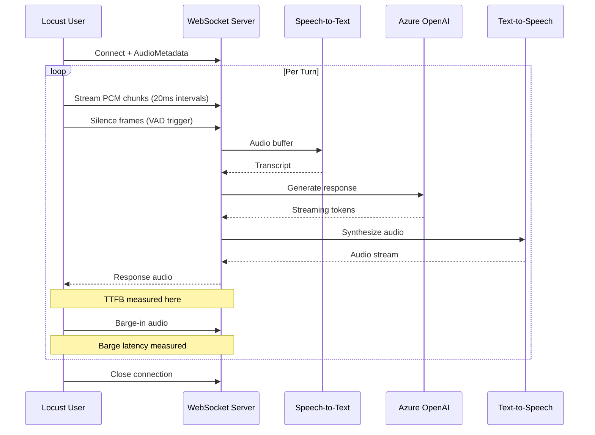

# Load Testing

:material-chart-line: Comprehensive WebSocket load testing framework for real-time voice agents using **Locust** with realistic conversation simulation.

!!! tip "Related Documentation"
    For unit tests, integration tests, and code quality validation, see the [Testing Framework](testing.md).

!!! info "Orchestration Modes"
    Both ACS Media and Browser Conversation tests use the **Custom Cascade Orchestrator** by default (Azure Speech STT → Azure OpenAI → Azure Speech TTS). Set `PIPELINE=voicelive` to test the **VoiceLive SDK** pipeline instead (Azure OpenAI Realtime API with native audio I/O).

---

## Overview

The load testing framework validates WebSocket performance under realistic conversation scenarios:

| Feature | Description |
|---------|-------------|
| :material-language-python: **Locust-based** | Python WebSocket simulation with real audio streaming |
| :material-microphone: **Audio generation** | Production TTS-generated conversation audio (PCM) |
| :material-microsoft-azure: **Azure integration** | Seamless deployment to Azure Load Testing service |
| :material-message-text: **Realistic scenarios** | Multi-turn conversation patterns with barge-in |
| :material-speedometer: **Rate limit tracking** | Automatic detection of Azure OpenAI and Speech throttling |

---

## Quick Start

### Prerequisites

Ensure your environment is configured:

```bash
# Verify uv is available
uv --version

# Ensure backend is running
make start_backend
```

### Generate Test Audio

Audio files are automatically generated if not present, but you can pre-generate them:

```bash
make generate_audio
```

### Run Load Tests

=== "ACS Media Streaming"

    ```bash
    # Default: 15 users, 90 seconds, localhost:8010
    make run_load_test_acs_media

    # Custom configuration
    make run_load_test_acs_media \
      HOST=your-app.azurecontainerapps.io \
      USERS=50 \
      SPAWN_RATE=5 \
      TIME=5m
    ```

=== "Browser Conversation"

    ```bash
    # Default: 15 users, 90 seconds, localhost:8010 (Custom Cascade)
    make run_load_test_browser_conversation

    # Use VoiceLive SDK pipeline instead
    make run_load_test_browser_conversation PIPELINE=voicelive

    # Custom configuration
    make run_load_test_browser_conversation \
      HOST=your-app.azurecontainerapps.io \
      USERS=50 \
      SPAWN_RATE=5 \
      TIME=5m \
      PIPELINE=voicelive
    ```

---

## Test Targets

Two Locust test files target different WebSocket endpoints:

| Test | Endpoint | Use Case |
|------|----------|----------|
| `locustfile.acs_media.py` | `/api/v1/media/stream` | ACS Call Automation (phone calls via Azure Communication Services) |
| `locustfile.browser_conversation.py` | `/api/v1/realtime/conversation` | Browser-based voice conversations |

### Pipeline Selection

Both test files support two orchestration pipelines controlled via `PIPELINE` environment variable:

| Pipeline | Value | Description |
|----------|-------|-------------|
| **Custom Cascade** | `cascade` (default) | Azure Speech STT → Azure OpenAI Chat → Azure Speech TTS |
| **VoiceLive SDK** | `voicelive` | Azure OpenAI Realtime API with native audio input/output |

!!! note "Same Orchestrator, Different Transports"
    Both ACS and Browser routes use the **same Custom Cascade Orchestrator** for speech processing. The difference is the transport layer: ACS uses Azure Communication Services media streaming, while Browser uses direct WebSocket from the client.

---

## Audio Generation

### Production TTS Integration

The audio generator uses Azure Speech Services to create realistic conversation audio:

```python
synthesizer = SpeechSynthesizer(
    region=os.getenv("AZURE_SPEECH_REGION"),
    key=os.getenv("AZURE_SPEECH_KEY"),
    language="en-US",
    voice="en-US-JennyMultilingualNeural",
    playback="never",
    enable_tracing=False
)
```

### Generated Structure

```
tests/load/audio_cache/
├── turn_001.pcm
├── turn_002.pcm
├── turn_003.pcm
├── turn_004.pcm
├── turn_005.pcm
└── manifest.jsonl
```

### Audio Format

| Property | Value | Description |
|----------|-------|-------------|
| **Format** | 16-bit PCM | Raw audio compatible with WebSocket streaming |
| **Sample Rate** | 16 kHz | Optimized for speech recognition |
| **Channels** | Mono | Single channel for conversation |
| **Chunk Size** | 640 bytes | 20ms frames at 16kHz/16-bit |

---

## Metric Naming Convention

The load tests use consistent, short metric names for clean table output:

| Metric | Description |
|--------|-------------|
| `ttfb/{N}` | Time-to-first-byte for turn N (zero-padded) |
| `barge/{N}` | Barge-in latency for turn N |
| `turn/{N}` | Total turn completion time (realtime only) |
| `ws/close` | WebSocket closed (benign if `WS_IGNORE_CLOSE_EXCEPTIONS=true`) |
| `ws/error` | WebSocket connection error |
| `turn/error` | Turn processing error |
| `rate/openai` | Azure OpenAI rate limit detected (429) |
| `rate/speech` | Azure Speech rate limit detected |
| `rate/unknown` | Unknown rate limit source |
| `err/{code}` | Specific error code from server |

### Sample Output

```
Name          # reqs   Avg   Min   Max   Fails
───────────────────────────────────────────────
ttfb/01           15  1234   500  3000   2
ttfb/02           15  1156   450  2800   1
barge/01          15  8765  2000 15000   3
barge/02          15  7890  1800 14000   2
rate/openai        5     0     0     0   5
───────────────────────────────────────────────
```

### Rate Limit Summary

At the end of each test run, a summary is printed:

```
============================================================
RATE LIMIT SUMMARY
============================================================
  openai              :    15 occurrences
  speech              :     3 occurrences
============================================================
```

---

## Configuration Reference

### Makefile Parameters

| Parameter | Default | Description |
|-----------|---------|-------------|
| `HOST` | `localhost:8010` | Target host (without protocol) |
| `USERS` | `15` | Number of concurrent simulated users |
| `SPAWN_RATE` | `2` | Users spawned per second |
| `TIME` | `90s` | Test duration |
| `PIPELINE` | `cascade` | Orchestration pipeline (`cascade` or `voicelive`) |
| `EXTRA_ARGS` | _(empty)_ | Additional Locust arguments |

### Environment Variables

Configure test behavior via environment variables:

```bash
# Pipeline selection (cascade or voicelive)
export PIPELINE="cascade"  # Default: Custom Cascade (STT→LLM→TTS)
# export PIPELINE="voicelive"  # VoiceLive SDK (OpenAI Realtime API)

# Connection
export WS_URL="ws://localhost:8010/api/v1/media/stream"
export PCM_DIR="tests/load/audio_cache"

# Turn configuration
export TURNS_PER_USER=60          # Turns per user session
export CHUNKS_PER_TURN=100        # Audio chunks per turn (~2s at 20ms)
export CHUNK_MS=20                # Milliseconds per audio chunk

# Timing thresholds
export FIRST_BYTE_TIMEOUT_SEC=5.0 # Max wait for first server response
export BARGE_QUIET_MS=400         # Silence gap to detect response end
export TURN_TIMEOUT_SEC=15.0      # Max wait for turn completion
export PAUSE_BETWEEN_TURNS_SEC=1.5

# Error handling
export WS_IGNORE_CLOSE_EXCEPTIONS=true
export WS_MAX_SSL_FAILS=4
export WS_RECONNECT_BACKOFF_BASE_SEC=0.2
```

### Detection Tokens

Control what server messages indicate response completion:

```bash
export RESPONSE_TOKENS="recognizer,greeting,response,transcript,result"
export END_TOKENS="final,end,completed,stopped,barge"
```

---

## Test Architecture

### WebSocket Simulation Flow



### Rate Limit Detection

The tests automatically detect and track Azure service rate limits:

=== "Azure OpenAI"

    Detected patterns:

    - `RateLimitExceeded`
    - `429` status codes
    - `too many requests`
    - `tokens per minute`
    - `requests per minute`

=== "Azure Speech"

    Detected patterns:

    - `quota exceeded`
    - `throttl` (throttle/throttled/throttling)
    - `speech` + `limit`

---

## Performance Targets

### Latency Benchmarks

| Metric | Target | Acceptable | Alert |
|--------|--------|------------|-------|
| **TTFB P95** | < 2000ms | < 3000ms | > 4000ms |
| **Barge-in P95** | < 500ms | < 1000ms | > 2000ms |
| **Connection Success** | > 98% | > 95% | < 90% |
| **Turn Success** | > 95% | > 90% | < 85% |

### Capacity Targets by Environment

| Environment | Users | Duration | Success Rate |
|-------------|-------|----------|--------------|
| **Development** | 10 | 5 min | > 95% |
| **Staging** | 100 | 30 min | > 95% |
| **Production** | 500+ | 60 min | > 98% |

---

## Azure Load Testing Integration

### Overview

[Azure Load Testing](https://learn.microsoft.com/en-us/azure/load-testing/overview-what-is-azure-load-testing) provides a fully managed service for running Locust tests at scale.

### Setup Steps

#### 1. Create Azure Load Testing Resource

```bash
az load create \
  --name "voice-agent-loadtest" \
  --resource-group "rg-voice-agent" \
  --location "eastus"
```

#### 2. Upload Test Files

Upload to Azure Load Testing:

- `tests/load/locustfile.acs_media.py`
- All PCM files from `tests/load/audio_cache/`

#### 3. Configure Environment

Set environment variables in Azure Load Testing:

```bash
WS_URL=wss://your-backend.azurecontainerapps.io/api/v1/media/stream
PCM_DIR=./
TURNS_PER_USER=3
WS_IGNORE_CLOSE_EXCEPTIONS=true
```

#### 4. Scale Configuration

| Environment | Virtual Users | Spawn Rate | Duration | Engines |
|-------------|---------------|------------|----------|---------|
| Development | 5-10 | 1-2/sec | 5-10 min | 1-2 |
| Staging | 50-100 | 5-10/sec | 15-30 min | 3-5 |
| Production | 200-500 | 20-50/sec | 30-60 min | 5-10 |

!!! info "Documentation"
    [Azure Load Testing Quickstart](https://learn.microsoft.com/en-us/azure/load-testing/quickstart-create-and-run-load-test)

---

## Troubleshooting

### Common Issues

=== "No Audio Files"

    ```bash
    # Generate audio files
    make generate_audio

    # Verify files exist
    ls -la tests/load/audio_cache/
    ```

=== "Connection Refused"

    ```bash
    # Ensure backend is running
    make start_backend

    # Test WebSocket connectivity
    curl -i -N \
      -H "Connection: Upgrade" \
      -H "Upgrade: websocket" \
      -H "Sec-WebSocket-Key: test" \
      -H "Sec-WebSocket-Version: 13" \
      http://localhost:8010/api/v1/media/stream
    ```

=== "SSL Errors"

    ```bash
    # For local testing, use ws:// not wss://
    make run_load_test_acs_media HOST=localhost:8010

    # For Azure, ensure TLS is configured
    make run_load_test_acs_media HOST=your-app.azurecontainerapps.io
    ```

=== "Rate Limits"

    Check the rate limit summary at the end of the test. If you see many rate limit events:

    - **Azure OpenAI**: Increase TPM quota or add retry logic
    - **Azure Speech**: Check concurrent connection limits
    - **Unknown**: Review server logs for throttling source

### Debug Mode

```bash
# Run single user with verbose output
locust -f tests/load/locustfile.acs_media.py \
  --host=ws://localhost:8010/api/v1/media/stream \
  --users 1 \
  --spawn-rate 1 \
  --run-time 60s \
  --headless \
  --loglevel DEBUG
```

---

## CI/CD Integration

### GitHub Actions Example

```yaml
name: Load Test

on:
  workflow_dispatch:
    inputs:
      users:
        description: 'Number of concurrent users'
        default: '20'
      duration:
        description: 'Test duration'
        default: '5m'

jobs:
  load-test:
    runs-on: ubuntu-latest
    steps:
      - uses: actions/checkout@v4

      - name: Set up Python
        uses: actions/setup-python@v5
        with:
          python-version: '3.11'

      - name: Install dependencies
        run: |
          pip install locust websocket-client certifi

      - name: Generate audio files
        run: make generate_audio
        env:
          AZURE_SPEECH_REGION: ${{ secrets.AZURE_SPEECH_REGION }}
          AZURE_SPEECH_KEY: ${{ secrets.AZURE_SPEECH_KEY }}

      - name: Run load test
        run: |
          make run_load_test_acs_media \
            HOST=${{ secrets.STAGING_HOST }} \
            USERS=${{ inputs.users }} \
            TIME=${{ inputs.duration }}

      - name: Upload results
        uses: actions/upload-artifact@v4
        with:
          name: load-test-results
          path: locust_report_*.csv
```

---

## Resources

!!! abstract "References"
    - :material-book-open-variant: [Locust Documentation](https://docs.locust.io/en/stable/)
    - :material-microsoft-azure: [Azure Load Testing](https://learn.microsoft.com/en-us/azure/load-testing/overview-what-is-azure-load-testing)
    - :material-microphone: [Azure Speech Services](https://learn.microsoft.com/en-us/azure/ai-services/speech-service/text-to-speech)
    - :material-brain: [Azure OpenAI Rate Limits](https://learn.microsoft.com/en-us/azure/ai-services/openai/quotas-limits)
